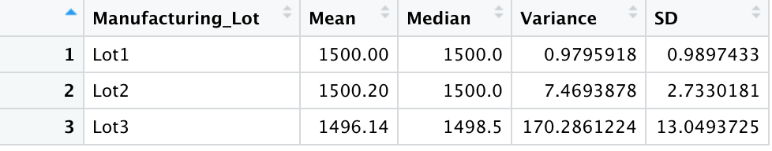
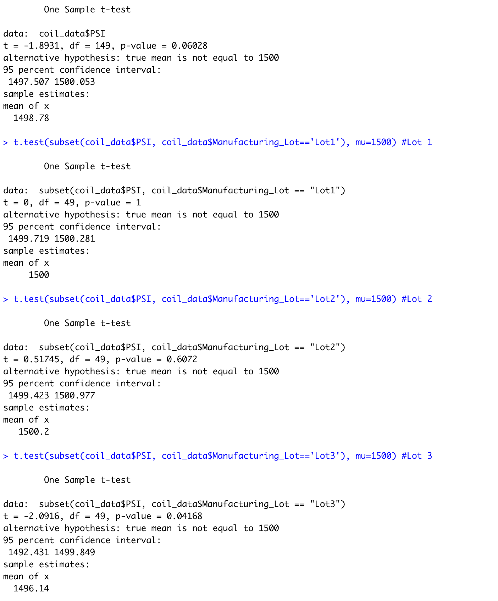

# MechaCar_Statistical_Analysis
## Linear Regression to Predict MPG
### Which variables/coefficients provided a non-random amount of variance to the mpg values in the dataset?
- vehicle length (p = 2.60e-12) and ground clearance (p = 5.21e-08).

### Is the slope of the linear model considered to be zero? Why or why not?
- no because the r-squared value is highly significant (p = 5.35e-11)

### Does this linear model predict mpg of MechaCar prototypes effectively? Why or why not?
- yes, the r-squared is 0.7149 (71% of variance explained) and the p value is less than .05 for the model (p = 5.35e-11).
- there might be overfitting though becuase three variables did not significantly predict mpg (vehicle weight, spoiler angle, and AWD)

## Summary Statistics on Suspension Coils
### Overall Summary Pic

### Lot Summary Pic

- Overall mean PSI is 1498.78, median PSI is 1500, variance of the PSI is 62.29356, standard deviation of the PSI is 7.892627.
- Lot3 had the overall lowest mean, median PSI with highest variance and standard deviation. 

### The design specifications for the MechaCar suspension coils dictate that the variance of the suspension coils must not exceed 100 pounds per square inch.
### Does the current manufacturing data meet this design specification for all manufacturing lots in total and each lot individually? Why or why not?
- Overall it meets the specification, but it doesn't meet the specification for Lot 3 because the variance for Lot 3 is 170.29. The variances for Lot 1 and 2 are < 100 PSI, however.

## T-Tests on Suspension Coils 

- Overall the true mean was not significantly different from the population mean of 1500 PSI because the p value was 0.06028 which is greater than .05.
- Lot 1 and lot 2 means were not significantly different from the population mean of 1500 PSI because the p values were 1 and .6072, respectively which are greater than .05.
- Lot 3 mean PSI was significantly different from the population mean of 1500 PSI because the p value was 0.04168 which is less than .05.

## Study Design: MechaCar vs Competition
### Write a short description of a statistical study that can quantify how the MechaCar performs against the competition. In your study design, think critically about what metrics would be of interest to a consumer: for a few examples, cost, city or highway fuel efficiency, horse power, maintenance cost, or safety rating.
### In your description, address the following questions:
#### What metric or metrics are you going to test?
- I will compare MechaCar mpg to other cars.

#### What is the null hypothesis or alternative hypothesis?
- The null hypothesis is that MechaCar mpg will not be significantly diffferent from the "population" (average of other cars) mpg. 

#### What statistical test would you use to test the hypothesis? And why?
- I would perform a two-tailed, one-sample t-test of the mpg's for MechaCars vs. the mean mpg of the population of other cars.

#### What data is needed to run the statistical test?
- The complete listing of mpg's for MechaCars and the population mean mpg for the other cars.

 
